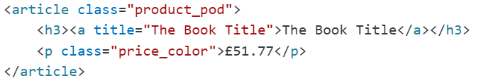
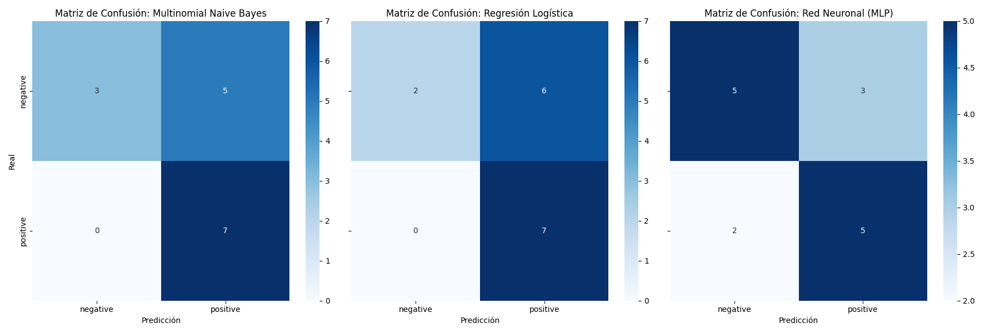
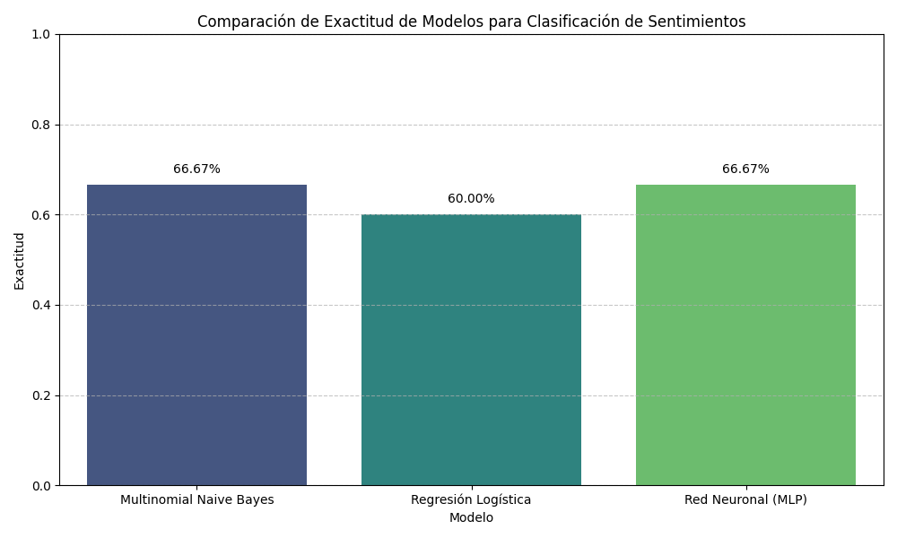

# Especializacón IA y Big-Data

Curso de Especialización de Inteligencia Artificial y Big Data

## Descripción

Este repositorio contiene algunos de los ejercicios de laboratorios que he realizado durante el curso oficial de Inteligencia Artificial y Big Data. Los laboratorios que no aparecen en este repositorio, es porque son ejercicios realizados en plataformas o herramientas como AWS, Make, Power BI.

## Dependencias

> pip install pandas

> pip install selenium

> pip install scikit-learn

> pip install matplotlib

## Laboratorios Big Data

### 1. Implementación de un flujo ETL en Python

Este laboratorio tiene como objetivo comprender y aplicar el proceso ETL (Extracción, Transformación y Carga) utilizando Python, basado en un caso práctico de un ecommerce en crecimiento. Aprenderemos a manipular datos de un archivo CSV, transformarlos para análisis y cargarlos en una base de datos SQLite.

#### 5. Predicción de Precios en Marketplaces con Cloud Computing, Web Scraping, Machine Learning, Automatización y Visualización.

Desarrollar un sistema automatizado para la extracción y análisis de precios en marketplaces. Se utilizará web scraping para recolectar información de productos desde una tienda en línea, se almacenarán los datos en Google Sheets, y se aplicará un modelo de regresión lineal para predecir la evolución de los precios. Todo el proceso será gestionado tanto de forma local, como a través de computación en la nube y mediante la automatización de Make en la nube. Los resultados se visualizarán a través de alguna herramienta como Power BI, Tableau, Airtable o similar.

[API: Tienda de libros](https://books.toscrape.com/)

Estructura de la página.

## Laboratorios Inteligencia Artificial

### 1. Análisis de Sentimientos para Reseñas de Productos clasificar reseñas de productos en positivas o negativas

Aprender a construir un modelo de inteligencia artificial sencillo utilizando Python. El objetivo es clasificar reseñas de productos en positivas o negativas, entendiendo el proceso paso a paso y el porqué de cada acción.

Los resultados obtenidos son muy interesantes y reflejan los desafíos comunes con conjuntos de datos pequeños en el análisis de sentimientos.

Tamaño del Dataset y sus Implicaciones
Entrenamiento: 35 muestras

Prueba: 15 muestras

Este es el principal factor que limita el rendimiento de tus modelos. Con solo 35 reseñas para entrenar, los modelos tienen muy poca información para aprender los patrones complejos del lenguaje y el sentimiento. Es como intentar aprender un idioma completo leyendo solo 35 frases.

De los tres modelos con los que se ha realizado el laboratorio, el MLP muestra un balance mucho mejor entre las clases. Aunque su exactitud general es similar a MNB, no tiene una polarización tan fuerte hacia una clase. Es capaz de identificar mejor los negativos (5 correctos vs 3 de MNB y 2 de LR) pero introduce algunos falsos negativos.

.

.

### 2. Predicción del Abandono Escolar

La propuesta es utilizar Machine Learning para desarrollar un modelo que prediga el riesgo de abandono escolar basado en datos históricos de los alumnos, permitiendo a las escuelas tomar medidas preventivas de manera anticipada.
